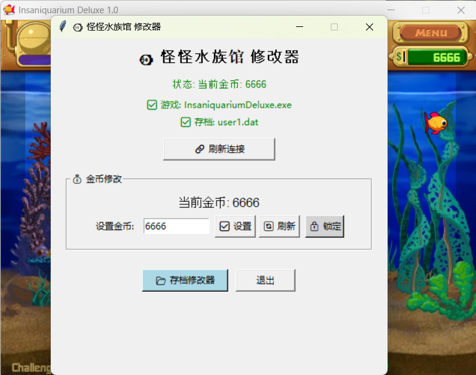
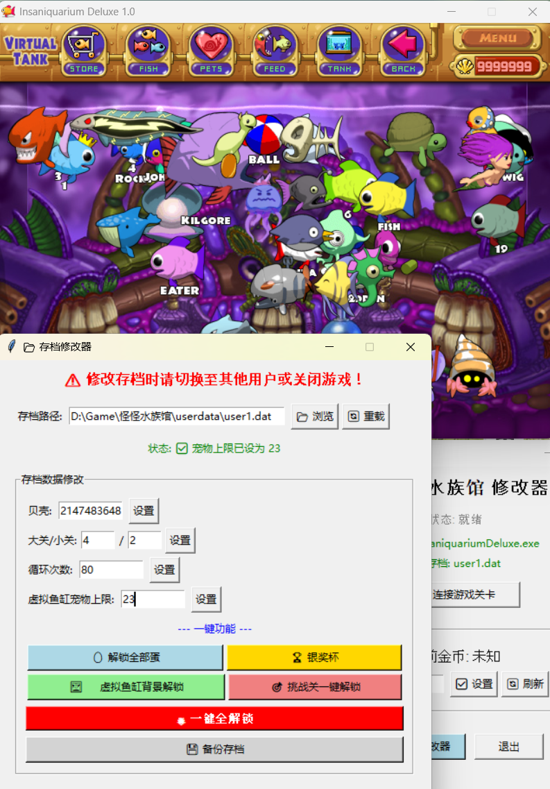

# Insaniquarium_hack
Disclaimer: This is for educational and technical discussion purposes only. Any commercial use is strictly prohibited.

# 🐠 Insaniquarium Deluxe Trainer

[](https://www.python.org/)
[](LICENSE)

> A trainer for *Insaniquarium Deluxe* featuring both memory editing and save file modification.

---

## ✨ Features

### 💰 Memory Editing (Real-time)
- Auto-attach to game process
- Read & modify in-game coins
- Lock coins (never run out)

### 📂 Save File Editing (Permanent)
- Modify shell count
- Modify level progress (world / stage)
- Modify loop count (Boss kills)
- Modify virtual tank pet limit
- Unlock all pets / eggs (one-click)
- Unlock all virtual tank backgrounds (one-click)
- Unlock silver trophy (one-click)
- Unlock challenge mode buttons (one-click)
- 🌟 One-click full unlock (everything)
- Backup save file (one-click)

### 🗂️ Save File Support
- Auto-detect game process
- Auto-locate save file path
- Manually switch between `user1` / `user2` / `user3` saves

---

## 🖼️ Screenshots

| 主界面 | 存档修改器 |
|---|---|
|  |  |

---

## 🚀 How to Use

### Option 1: Download EXE (Recommended)
1. Go to [Releases](../../releases) and download the latest `InsaniquariumTrainer.exe`
2. Run as **administrator**
3. Click `Connect to Game` and start editing

### Option 2: Run from Source
```bash
# 1. Clone the repo
git clone https://github.com/your-username/your-repo.git
cd your-repo

# 2. Install dependencies
pip install -r requirements.txt

# 3. Run
python trainer.py
```

---

## 📦 Dependencies

- Python 3.10+
- pymem
- tkinter (built-in)
- psutil

---

## ⚠️ Important Notes

1. **Memory editing**: Works while the game is running. Changes are lost after game restart.
2. **Save editing**: **Close the game before modifying save files**, otherwise the game will overwrite your changes.
3. Always click `Backup Save` before making changes to avoid corruption.
4. Antivirus may flag this tool as a false positive due to memory read/write operations.

---

## 🛠️ Build EXE from Source

```bash
pyinstaller -F -w trainer.py
```

---

## 📄 License

This project is licensed under the [MIT License](LICENSE).

---

## 🙏 Credits

- [Cheat Engine](https://www.cheatengine.org/) - Memory reverse engineering tool
- [pymem](https://github.com/srounet/pymem) - Python memory read/write library

---

## 📬 Feedback

Email: purgationdevil@gmail.com

---

**⭐ If this project helped you, give it a Star!** ⭐
